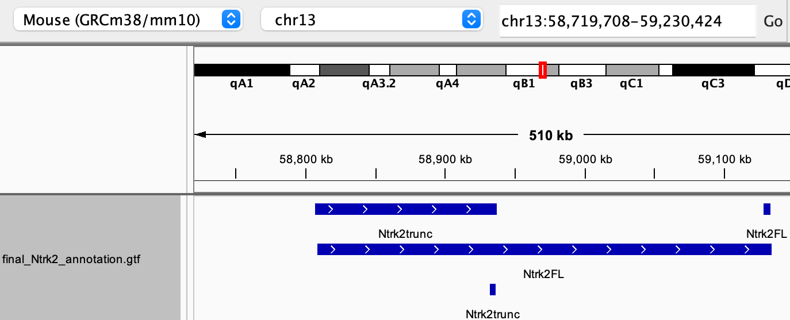

# 🔍 Overview

This markdown file documents a three-step pipeline for extracting, customizing, and reintegrating transcript annotations in a GTF file. The example focuses on the gene Ntrk2, but the logic can be generalized to any gene of interest.

1️⃣ GTF Transcript Extractor: to extract all entries related to specific transcript IDs from a GTF annotation file.

2️⃣ Transcript Attribute Cleaner and Modifier: to simplify and standardize the extracted transcript entries to prepare for reinsertion.
Making transcript isoforms as distinct gene features. 

3️⃣ Final GTF Cleaner & Custom Transcript Merger: to remove all original entries for the gene of interest and replace them with cleaned, custom transcript models.

----------------------------------

## 📄 GTF Transcript Extractor

This script extracts specific **transcript entries** from a GTF file using transcript IDs. It's useful for isolating annotations related to specific genes or transcripts — for example, extracting isoforms of a gene like `Ntrk2`.

---

### 🧬 Purpose

Given a list of transcript IDs, this script:
- Extracts all lines in the GTF file that mention those transcript IDs.
- Optionally includes surrounding lines for context (all parent gene entries).
- Removes duplicate lines to produce a clean, minimal file.

---

### 🔍 Extract Ntrk2 Transcript Entries from GTF

This script extracts specific **Ntrk2 transcript entries** (e.g., `Ntrk2-201`, `Ntrk2-202`) from a GTF annotation file. It includes both the **transcript lines** and their **associated parent gene lines**, if present.

---

### 🧾 Script: `extract_Ntrk2_transcripts.sh`

```
#!/bin/bash

# ===== CONFIGURATION =====
input_gtf="original.gtf"
output_txt="Ntrk2_transcripts.txt"

# Ntrk2 identifiers
GENE_ID="ENSMUSG00000055254.14"       # gene ID
FL_ISOFORM="ENSMUST00000079828.5"     # Full-length (Ntrk2FL)
TRUNC_ISOFORM="ENSMUST00000109838.8"  # Truncated (Ntrk2trunc)

# ===== EXTRACTION =====
echo "Extracting Ntrk2 isoforms..."
grep -E "transcript_id \"($FL_ISOFORM|$TRUNC_ISOFORM)\"" "$input_gtf" > "$output_txt"
grep -A 1 -B 1 -E "transcript_id \"($FL_ISOFORM|$TRUNC_ISOFORM)\"" "$input_gtf" >> "$output_txt"
sort -u "$output_txt" > temp && mv temp "$output_txt"

echo "✅ Extracted:"
echo "- $FL_ISOFORM (Ntrk2FL)"
echo "- $TRUNC_ISOFORM (Ntrk2trunc)"
echo "Output: $output_txt"

```


## 🛠️ Transcript Attribute Cleaner and Modifier

This script processes a subset of GTF transcript entries — for example, those extracted for `Ntrk2` — by simplifying and modifying the attributes column. It rewrites transcript entries to represent minimal custom gene models such as `short-Ntrk2` and `long-Ntrk2`.

---

### 🎯 Purpose

Given a GTF file containing selected transcript entries (e.g., from `Ntrk2_transcripts.txt`), this script:

1. Replaces the `gene_id` field with the **transcript ID**.
2. Assigns a custom **gene name** (`short-Ntrk2` or `long-Ntrk2`) based on the transcript ID.
3. Removes the `transcript_id` and **all other attributes**, retaining only:
   - `gene_id`
   - `gene_name`
4. Converts feature type `"transcript"` to `"gene"` (for simplification).

---

### 🧾 Script: `process_Ntrk2_transcripts.sh`
```
#!/bin/bash

# ===== CONFIGURATION =====
GENE_ID="ENSMUSG00000055254.14"      # gene ID
GENE_NAME="Ntrk2"
FL_ISOFORM="ENSMUST00000079828.5"    # Full-length
TRUNC_ISOFORM="ENSMUST00000109838.8" # Truncated

INPUT_FILE="Ntrk2_transcripts.txt"    # From extractor
OUTPUT_FILE="processed_Ntrk2_transcripts.gtf"

# ===== PROCESSING =====
awk -F'\t' -v fl="$FL_ISOFORM" -v trunc="$TRUNC_ISOFORM" \
           -v gene="$GENE_NAME" '
BEGIN {OFS = FS}
{
    tid = ""
    split($9, attrs, ";")
    for (i in attrs) {
        if (attrs[i] ~ /transcript_id/) {
            split(attrs[i], t, "\"")
            tid = t[2]
            break
        }
    }

    if (tid == "") { print; next }

    # Apply corrected naming convention
    if (tid == fl) $9 = "gene_id \"" tid "\"; gene_name \"Ntrk2FL\";"
    else if (tid == trunc) $9 = "gene_id \"" tid "\"; gene_name \"Ntrk2trunc\";"
    
    if ($3 == "transcript") $3 = "gene"
    print
}' "$INPUT_FILE" > "$OUTPUT_FILE"

echo "✅ Created custom entries:"
grep 'gene_name' "$OUTPUT_FILE" | awk -F'"' '{print $2}' | sort | uniq -c

```

## 🧬 Final GTF Cleaner & Custom Transcript Merger:


This script removes all traces of a specific gene (e.g., `Ntrk2`) from a GTF annotation file and inserts custom-curated transcript entries in its place. The result is a clean, final GTF annotation ready for visualization or downstream analysis.
IGV is recommended for viewing the "new genes'" annotation. The resulting GTF file will be sorted, so indexing using IGV-tools is the only step needed before viewing.


---

### 🎯 Purpose

Given:
- An **original GTF** file (e.g., from Ensembl or GENCODE)
- A **custom GTF** containing processed transcripts (e.g., `short-Ntrk2`, `long-Ntrk2`)

This script:
1. Removes all entries associated with the original gene and its transcripts.
2. Appends curated transcript entries from a custom GTF.
3. Sorts the result to maintain GTF compatibility.
4. Validates the replacement.
5. Outputs a clean `final_annotation.gtf`.

---

### 🧾 Script: `finalise_Ntrk2_gtf.sh` - this script takes about 40-60 seconds to run 

```
#!/bin/bash

# ===== CONFIGURATION =====
LOG_FILE="finalize_gtf.log"
ERROR_FILE="finalize_gtf.errors"
GENE_ID="ENSMUSG00000055254.14"      # Ntrk2 gene ID
FL_ISOFORM="ENSMUST00000079828.5"    # Full-length
TRUNC_ISOFORM="ENSMUST00000109838.8" # Truncated
FL_NAME="Ntrk2FL"                    # Custom name
TRUNC_NAME="Ntrk2trunc"              # Custom name

ORIGINAL_GTF="original.gtf"
PROCESSED_TRANSCRIPTS="processed_Ntrk2_transcripts.gtf"
FINAL_GTF="final_Ntrk2_annotation.gtf"

# Clear previous logs
:> "$LOG_FILE"
:> "$ERROR_FILE"

# ===== FUNCTIONS =====
log() {
    echo "$(date '+%Y-%m-%d %H:%M:%S') - $1" | tee -a "$LOG_FILE"
}

error() {
    echo "$(date '+%Y-%m-%d %H:%M:%S') - ERROR: $1" | tee -a "$LOG_FILE" "$ERROR_FILE"
    exit 1
}

# ===== MAIN EXECUTION =====
log "Starting GTF finalisation..."

# Validate input files
[ -f "$ORIGINAL_GTF" ] || error "Missing input GTF: $ORIGINAL_GTF"
[ -f "$PROCESSED_TRANSCRIPTS" ] || error "Missing processed transcripts: $PROCESSED_TRANSCRIPTS"

# ===== STRICT CLEANING =====
log "Removing all Ntrk2 traces..."
if ! grep -v -E \
    -e "gene_id \"${GENE_ID}\"" \
    -e "gene_name \"Ntrk2\"" \
    -e "transcript_id \"(${FL_ISOFORM}|${TRUNC_ISOFORM})\"" \
    -i -e "Ntrk2" \
    "$ORIGINAL_GTF" > temp_stage1.gtf 2>> "$ERROR_FILE"; then
    error "Failed during Ntrk2 removal"
fi

log "Removing contaminants..."
if ! grep -v "gene_id \"ENSMUSG00000021557" temp_stage1.gtf > temp_stage2.gtf 2>> "$ERROR_FILE"; then
    error "Failed during contaminant removal"
fi

# ===== ADD CUSTOM ISOFORMS =====
log "Inserting custom isoforms..."
if ! cat "$PROCESSED_TRANSCRIPTS" >> temp_stage2.gtf 2>> "$ERROR_FILE"; then
    error "Failed to append custom isoforms"
fi

# ===== FINAL SORTING =====
log "Generating final GTF..."
{
    grep "^#" temp_stage2.gtf 2>/dev/null || true
    grep -v "^#" temp_stage2.gtf | sort -k1,1 -k4,4n 2>> "$ERROR_FILE"
} > "$FINAL_GTF" || error "Failed during sorting"

# ===== VALIDATION =====
log "=== VALIDATION RESULTS ==="
log "Custom isoforms count:"
grep -c "gene_name \"${FL_NAME}\"" "$FINAL_GTF" | tee -a "$LOG_FILE"
grep -c "gene_name \"${TRUNC_NAME}\"" "$FINAL_GTF" | tee -a "$LOG_FILE"

log "Checking for contaminants..."
CONTAMINANTS=$(grep -i "Ntrk2" "$FINAL_GTF" | grep -vE "${FL_NAME}|${TRUNC_NAME}")
if [ -n "$CONTAMINANTS" ]; then
    error "Found remaining contaminants:\n$CONTAMINANTS"
else
    log "No Ntrk2 contaminants found"
fi

OTHER_GENES=$(grep "ENSMUSG00000021557" "$FINAL_GTF")
if [ -n "$OTHER_GENES" ]; then
    error "Found unrelated genes:\n$OTHER_GENES"
else
    log "No unrelated genes found"
fi

# ===== CLEANUP =====
rm temp_stage*.gtf
log "✅ Successfully generated $FINAL_GTF"
echo "Detailed logs available in: $LOG_FILE"
if [ -s "$ERROR_FILE" ]; then
    echo "⚠️  Errors detected - see $ERROR_FILE"
fi

```
# Important Validation Note

Despite rigorous cleaning steps to remove all traces of the original Ntrk2 parent gene, visual inspection in IGV is strongly recommended because:

- Potential Residual Annotations

- Some genomic viewers (like IGV) may still display the original gene if:

    - A single annotation line (e.g., gene or mRNA feature) remains in the GTF

    - The gene appears in reference genome tracks

## Validation Protocol


Before analysis:

Search the final GTF for residual Ntrk2 entries:

```
grep -i 'gene_name "Ntrk2"' final_annotation.gtf | grep -vE "Ntrk2FL|Ntrk2trunc"
```


## IGV-specific checks:

- Load the modified GTF 

- Search for "Ntrk2" in the region of interest

- Verify only two genes appear:

*Ntrk2FL (full-length isoform)

*Ntrk2trunc (truncated isoform)

**If Contaminants Persist**

Use this nuclear cleanup command:

```
awk -F'\t' '$3 != "gene" || $9 !~ /Ntrk2/' final_annotation.gtf > cleaned_final.gtf
```

This removes any lingering gene-type entries containing "Ntrk2".


 
*<sup>This should show only your custom isoforms (Ntrk2FL/Ntrk2trunc) with no parent gene</sup>*
